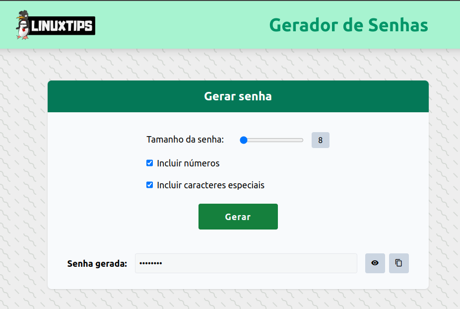

# DAY-3

# Dockerizando o projeto

> [!NOTE]
Os arquivos dos passos estão na pasta [Dockerizando_projeto](files/Dockerizando_projeto/)


### Clonando o projeto
```
https://github.com/israeldoamaral/giropops-senhas.git
```

### Acessando o diretório da aplicação
```
cd giropops-senhas
```

### Dockerfile
Crie o arquivo Dockerfile para a aplicação

vim Dockerfile.app
```
FROM python:3.11

WORKDIR /app
COPY requirements.txt .
COPY app.py .
COPY static/ static/
COPY templates/ templates/

RUN pip install --no-cache-dir -r requirements.txt

EXPOSE 5000

CMD ["flask", "run", "--host=0.0.0.0"]
```

### Buildando a imagem da aplicação
```
docker build -t israeldoamaral/giropops-senhas:1.0 -f Dockerfile.app .
```

### Listando a imagem criado da aplicação
```
docker image ls
```

### Criando uma rede para a comunicação dos containers
```
docker network create giropops
```

### Executando o container do Redis
```
docker container run -d -p 6379:6379 --network giropops --name redis redis
```

### Executando o container da aplicação
> [!TIP] Para a aplicação poder acessar o Redis, vamos passar um valor na variável de ambiente **REDIS_HOST=redis** que é o nome do container do Redis
```
docker run -d --name giropops-senhas --network giropops  -p 5000:5000 --env REDIS_HOST=redis giropops-senhas:1.0
```

### Listando os containers em execução
```
docker container ls
```

### Acessando no navegador
```
localhost:5000
```



## Tamanho e número de camadas da imagem<a name="tamanhoecamadas"></a>

As camadas de imagem Docker são uma parte essencial da arquitetura Docker e são fundamentais para sua eficiência e funcionalidade. Elas representam os diferentes estados de uma imagem Docker conforme são construídas e modificadas. Aqui está uma descrição geral das camadas de imagem Docker:  

1. **Camada Base (Base Layer):** Esta é a primeira camada de uma imagem Docker. Ela contém o sistema operacional base ou uma imagem de base que serve como ponto de partida para a construção de outras camadas. Geralmente, as imagens de base são imagens Linux como Alpine, Ubuntu, CentOS, etc.  

2. **Camadas de Pacotes (Package Layers):** Essas camadas contêm os pacotes e dependências adicionados à imagem. Cada instrução no Dockerfile (como RUN, COPY, ADD) cria uma nova camada na imagem. Por exemplo, se você instalar pacotes usando o RUN apt-get install, cada instalação de pacote será uma camada separada na imagem. Isso permite a reutilização eficiente de camadas comuns entre imagens.  

3. **Camada de Sistema de Arquivos de Leitura (Read-only File System Layer):** Após a construção das camadas de pacotes, o sistema de arquivos da imagem é marcado como somente leitura. Isso garante que a imagem seja imutável e não seja modificada acidentalmente.  

4. **Camada de Escrita (Writable Layer):** Esta camada é adicionada quando um contêiner é instanciado a partir da imagem. Ela permite que o contêiner escreva e faça alterações no sistema de arquivos da imagem. Qualquer alteração feita no contêiner, como a criação de novos arquivos ou a modificação de arquivos existentes, é armazenada nessa camada.  

Essa arquitetura em camadas é fundamental para a eficiência do Docker, pois permite a reutilização de camadas comuns entre imagens, reduzindo a quantidade de dados que precisam ser transferidos durante o processo de construção e implantação de contêineres. Isso resulta em tempos de construção mais rápidos, menor uso de armazenamento e melhor desempenho geral.

### Verificando as camadas da imagem  

Vamos analisar as camadas da imagem gerada  

```
$ docker history israeldoamaral/giropops-senhas:1.0  


IMAGE          CREATED       CREATED BY                                      SIZE      COMMENT
2bd548ceb790   5 days ago    CMD ["flask" "run" "--host=0.0.0.0"]            0B        buildkit.dockerfile.v0
<missing>      5 days ago    EXPOSE map[5000/tcp:{}]                         0B        buildkit.dockerfile.v0
<missing>      5 days ago    RUN /bin/sh -c pip install --no-cache-dir -r…   18.2MB    buildkit.dockerfile.v0
<missing>      5 days ago    COPY templates/ templates/ # buildkit           5.78kB    buildkit.dockerfile.v0
<missing>      5 days ago    COPY static/ static/ # buildkit                 112kB     buildkit.dockerfile.v0
<missing>      5 days ago    COPY app.py . # buildkit                        2.52kB    buildkit.dockerfile.v0
<missing>      5 days ago    COPY requirements.txt . # buildkit              52B       buildkit.dockerfile.v0
<missing>      5 days ago    WORKDIR /app                                    0B        buildkit.dockerfile.v0
<missing>      12 days ago   CMD ["python3"]                                 0B        buildkit.dockerfile.v0
<missing>      12 days ago   RUN /bin/sh -c set -eux;   wget -O get-pip.p…   11.2MB    buildkit.dockerfile.v0
<missing>      12 days ago   ENV PYTHON_GET_PIP_SHA256=dfe9fd5c28dc98b5ac…   0B        buildkit.dockerfile.v0
<missing>      12 days ago   ENV PYTHON_GET_PIP_URL=https://github.com/py…   0B        buildkit.dockerfile.v0
<missing>      12 days ago   ENV PYTHON_SETUPTOOLS_VERSION=65.5.1            0B        buildkit.dockerfile.v0
<missing>      12 days ago   ENV PYTHON_PIP_VERSION=24.0                     0B        buildkit.dockerfile.v0
<missing>      12 days ago   RUN /bin/sh -c set -eux;  for src in idle3 p…   32B       buildkit.dockerfile.v0
<missing>      12 days ago   RUN /bin/sh -c set -eux;   wget -O python.ta…   50.2MB    buildkit.dockerfile.v0
<missing>      12 days ago   ENV PYTHON_VERSION=3.11.9                       0B        buildkit.dockerfile.v0
<missing>      12 days ago   ENV GPG_KEY=A035C8C19219BA821ECEA86B64E628F8…   0B        buildkit.dockerfile.v0
<missing>      12 days ago   RUN /bin/sh -c set -eux;  apt-get update;  a…   18.6MB    buildkit.dockerfile.v0
<missing>      12 days ago   ENV LANG=C.UTF-8                                0B        buildkit.dockerfile.v0
<missing>      12 days ago   ENV PATH=/usr/local/bin:/usr/local/sbin:/usr…   0B        buildkit.dockerfile.v0
<missing>      6 days ago    /bin/sh -c set -ex;  apt-get update;  apt-ge…   587MB     
<missing>      6 days ago    /bin/sh -c set -eux;  apt-get update;  apt-g…   177MB     
<missing>      6 days ago    /bin/sh -c set -eux;  apt-get update;  apt-g…   48.4MB    
<missing>      6 days ago    /bin/sh -c #(nop)  CMD ["bash"]                 0B        
<missing>      6 days ago    /bin/sh -c #(nop) ADD file:ca6d1f0f80dd6c91b…   117MB
```  

> [!NOTE]
Perceba que além das camadas adicionadas por nós no nosso  Dockfile, exitem as camadas da imagem base que no caso usamos a **python:3.11**  


Embora as camadas de imagem Docker ofereçam muitos benefícios em termos de eficiência e reutilização, elas também podem apresentar alguns desafios e problemas potenciais:  

1. **Aumento do tamanho da imagem:** Cada camada adiciona um overhead ao tamanho total da imagem. Se uma imagem tiver muitas camadas, especialmente camadas grandes, ela pode se tornar significativamente maior do que o necessário. Isso pode aumentar os tempos de download e os requisitos de armazenamento.  

2. **Dificuldades de gerenciamento:** Com muitas camadas, pode ser difícil entender e gerenciar as dependências e os pacotes incluídos na imagem. Isso pode tornar a manutenção e a depuração mais complicadas, especialmente se as camadas não forem devidamente documentadas.  

3. **Aumento do tempo de construção:** Quanto mais camadas uma imagem tiver, mais tempo será necessário para construir e reconstruir a imagem. Isso ocorre porque o Docker precisa criar e armazenar cada camada separadamente, o que pode levar a um tempo de construção mais longo, especialmente em sistemas com recursos limitados.  

4. **Ineficiência na camada de escrita:** As alterações feitas em contêineres baseados em imagens com muitas camadas podem levar a uma fragmentação do sistema de arquivos e um aumento no consumo de espaço em disco. Isso ocorre porque o Docker cria uma nova camada de escrita para cada alteração, o que pode resultar em várias cópias de arquivos sendo armazenadas no disco.  

5. **Segurança:** Imagens com muitas camadas podem aumentar a superfície de ataque, pois cada camada representa um ponto de entrada potencial para exploração. Se uma camada contiver vulnerabilidades de segurança, elas podem ser propagadas para outras imagens construídas sobre essa base.  

Embora esses problemas possam surgir em imagens com muitas camadas, muitos deles podem ser mitigados com boas práticas de desenvolvimento e gerenciamento de imagens Docker, como a redução do número de camadas, a seleção cuidadosa das dependências e a otimização do Dockerfile.  

### Verificando o tamanho da imagem

```
$ docker image ls  

REPOSITORY                       TAG       IMAGE ID       CREATED         SIZE
israeldoamaral/giropops-senhas   1.0       2bd548ceb790   5 days ago      1.03GB
```

### Diminuindo tamanho da imagem

Para diminuir a imagem da aplicação vamos utilizar um imagem **slim** python:3.11-slim

```
FROM python:3.11-slim

WORKDIR /app
COPY requirements.txt .
COPY app.py .
COPY static/ static/
COPY templates/ templates/

RUN pip install --no-cache-dir -r requirements.txt

EXPOSE 5000

CMD ["flask", "run", "--host=0.0.0.0"]
```  

Vamos buildar a imagem e versionar para 2.0
```
docker build -t israeldoamaral/giropops-senhas:2.0 -f Dockerfile.app .
```  

verificando a diferença de tamanho das duas imagens

```
$ docker image ls                                                       
REPOSITORY                       TAG       IMAGE ID       CREATED         SIZE
israeldoamaral/giropops-senhas   2.0       8c53ce8bca1a   2 minutes ago   149MB
israeldoamaral/giropops-senhas   1.0       2bd548ceb790   5 days ago      1.03GB
```


## Distroless<a name="imagemdistroless"></a>

### A arte da Minimização  

**Introdução** 

No mundo dos containers, existe uma tendência emergente chamada "Distroless". Este termo é um neologismo que descreve uma imagem de container que contém apenas as dependências e artefatos necessários para a execução do aplicativo, eliminando a distribuição completa do sistema operacional. Neste capítulo, exploraremos o conceito de distroless, suas vantagens, desvantagens e como implementá-lo em seu próprio ambiente.

**O que é Distroless**  

"Distroless" refere-se à estratégia de construir imagens de containers que são efetivamente "sem distribuição". Isso significa que elas não contêm a distribuição típica de um sistema operacional Linux, como shell de linha de comando, utilitários ou bibliotecas desnecessárias. Ao invés disso, essas imagens contêm apenas o ambiente de runtime (como Node.js, Python, Java, etc.) e o aplicativo em si.  

**Benefícios do Distroless**  

O principal benefício das imagens Distroless é a segurança. Ao excluir componentes não necessários, o potencial de ataque é significativamente reduzido. Além disso, sem as partes extras do sistema operacional, o tamanho do container é minimizado, economizando espaço de armazenamento e aumentando a velocidade de deploy.  

**Desafios do Distroless**  

Apesar de seus benefícios, a estratégia Distroless não está isenta de desafios. Sem um shell ou utilitários de sistema operacional, a depuração pode ser mais complicada. Além disso, a construção de imagens Distroless pode ser um pouco mais complexa, pois requer uma compreensão cuidadosa das dependências do aplicativo.

**Implementando Distroless**  

Existem várias maneiras de implementar uma estratégia Distroless. A mais simples é usar uma das imagens base Distroless fornecidas pelo **Google** e pela **Chainguard**. Estas imagens são projetadas para serem o mais minimalistas possível e podem ser usadas como ponto de partida para a construção de suas próprias imagens de container.

## Diminuindo a imagem ainda mais

Para essa tarefa vamos utilizar as imagens da [**Chainguard**](https://www.chainguard.dev/chainguard-images). Altere ou crie um novo Dockerfile.

> [!TIP]  
OBS1: Vamos utilizar junto com a imagem Distroless o recurso já visto que é o Multi-satge Build.  
OBS2: Sempre lembrando de está no repositório da aplicação.

```
FROM cgr.dev/chainguard/python:latest-dev as builder

WORKDIR /app

COPY requirements.txt .

RUN pip install --no-cache-dir -r requirements.txt --user


FROM cgr.dev/chainguard/python:latest

WORKDIR /app

# Make sure you update Python version in path
COPY --from=builder /home/nonroot/.local/lib/python3.12/site-packages /home/nonroot/.local/lib/python3.12/site-packages
COPY --from=builder /home/nonroot/.local/bin  /home/nonroot/.local/bin
ENV PATH=$PATH:/home/nonroot/.local/bin

COPY app.py .
COPY static/ static/
COPY templates/ templates/

ENV REDIS_HOST="redis-server"

ENTRYPOINT ["flask", "run", "--host=0.0.0.0"]
```  

Vamos buildar a imagem e agora vamos versionar para 3.0
```
docker build -t israeldoamaral/giropops-senhas:3.0 -f Dockerfile.app .
```  

verificando a diferença de tamanho das três imagens
```
$ docker image ls  

REPOSITORY                       TAG       IMAGE ID       CREATED          SIZE
israeldoamaral/giropops-senhas   3.0       417a152343b3   13 seconds ago   72.8MB
israeldoamaral/giropops-senhas   2.0       8c53ce8bca1a   55 minutes ago   149MB
israeldoamaral/giropops-senhas   1.0       2bd548ceb790   5 days ago       1.03GB
```  

