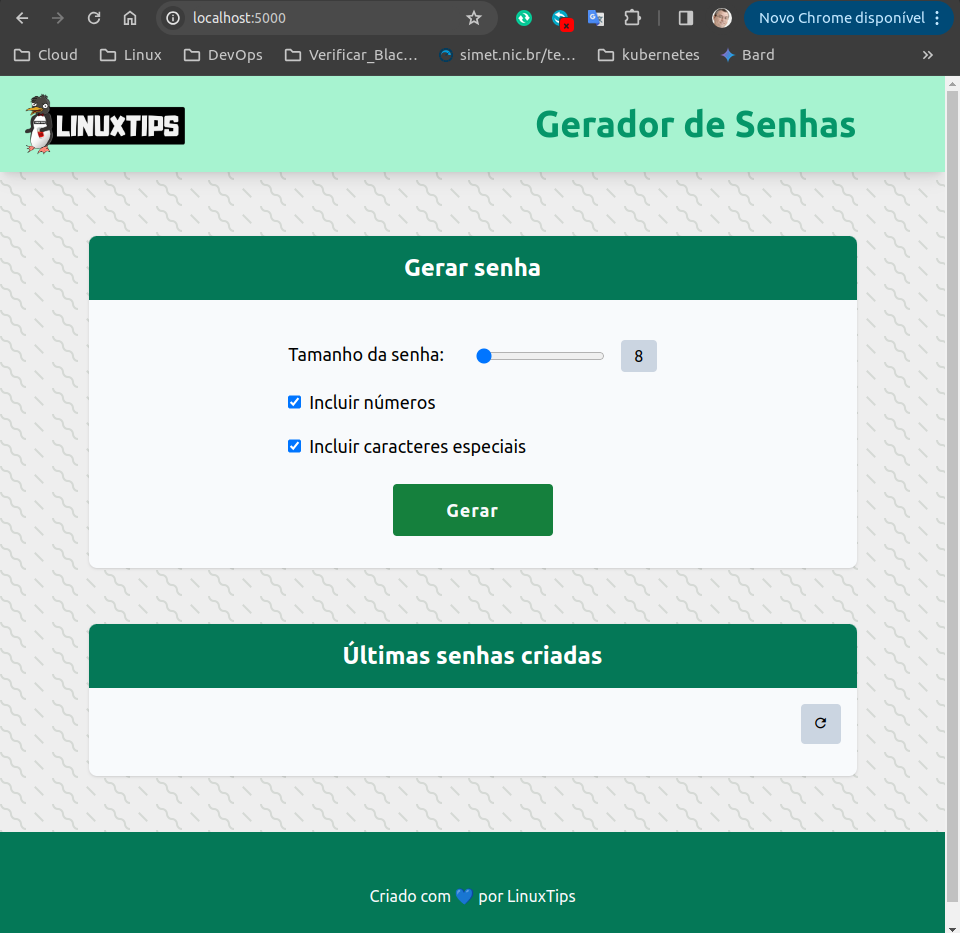
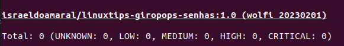
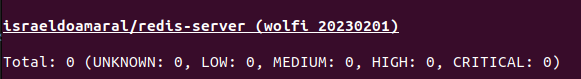

# LINUXtips-Giropops-Senhas
Repo para a prática do projeto PICK - Programa Intensivo de Docker e Kubernetes 2024.


# Ferramentas Utilizadas

* Docker
* Trivy
* Cosing

## Objetivo
Criar uma imagem segura, eficiente e minimalista utilizando como base o  projeto giropops-senha. Criar recursos de automação e monitoramento.

## Instalação das ferramentas

* Docker 
```
curl -fsSL https://get.docker.com/ | bash
```

* Trivy
```
sudo apt-get install wget apt-transport-https gnupg lsb-release
wget -qO - https://aquasecurity.github.io/trivy-repo/deb/public.key | sudo apt-key add -
echo deb https://aquasecurity.github.io/trivy-repo/deb $(lsb_release -sc) main | sudo tee -a /etc/apt/sources.list.d/trivy.list
sudo apt-get update
sudo apt-get install trivy
```

* Cosing
```
curl -O -L "https://github.com/sigstore/cosign/releases/latest/download/cosign-linux-amd64"
sudo mv cosign-linux-amd64 /usr/local/bin/cosign
sudo chmod +x /usr/local/bin/cosign
```


## Iniciando o projeto

### Vamos fazer o fork do repositório que contem a aplicação.

https://github.com/badtuxx/giropops-senhas

## Criação da Imagem Docker
> [!NOTE]
> Vamos criar a imagem da aplicação utilizando as melhores práticas como:<p>
**Multistage build** - Técnica para criar imagens Docker menores e mais eficientes. Permite que você crie um Dockerfile com vários estágios, cada um usando uma imagem base diferente.<p>
**Imagem Distroless** - é uma classe especial de imagem Docker que se destaca por sua abordagem minimalista. Ao contrário das imagens tradicionais, que incluem um sistema operacional completo (como Debian ou Ubuntu), as imagens Distroless contêm apenas o necessário para executar uma aplicação específica.
Para tanto iremos utilizar as imagens da [**Chainguard**](https://www.chainguard.dev/chainguard-images)
>- Isso traz vários benefícios:\
**Segurança:** Menos software significa menos superfície de ataque para hackers explorarem.\
**Tamanho:** Imagens menores significam downloads e inicializações mais rápidos.\
**Eficiência:** Menos processos em execução significam que seus contêineres consomem menos recursos.<p>

### Dockerfile
Vamos criar o arquivo **Dockerfile.app** para a geração da imagem distroless com multistage build, deixando-a com um tamanho pequeno e sem vulnerabilidades.

```
FROM cgr.dev/chainguard/python:latest-dev as builder

WORKDIR /app

COPY requirements.txt .

RUN pip install --no-cache-dir -r requirements.txt --user


FROM cgr.dev/chainguard/python:latest

WORKDIR /app

# Make sure you update Python version in path
COPY --from=builder /home/nonroot/.local/lib/python3.12/site-packages /home/nonroot/.local/lib/python3.12/site-packages
COPY --from=builder /home/nonroot/.local/bin  /home/nonroot/.local/bin
ENV PATH=$PATH:/home/nonroot/.local/bin

COPY app.py .
COPY static/ static/
COPY templates/ templates/

ENV REDIS_HOST="redis-server"

ENTRYPOINT ["flask", "run", "--host=0.0.0.0"]
```

Executando o Build da imagem

```
$ docker build -t israeldoamaral/linuxtips-giropops-senhas:1.0 -f Dockerfile.app .
```

O projeto também precisa persistir os dados, para isso vamos cria uma imagem do Redis. Crie o arquivo **Dockerfile.redis**

```
FROM  cgr.dev/chainguard/redis 

EXPOSE 6379

ENTRYPOINT [ "redis-server" ]
```

Executando o Build da imagem do Redis

```
$ docker build -t israeldoamaral/redis-server -f Dockerfile.redis .
```

## Testando as imagens
Vamos testar localmente se as imagens da aplicação e do Redis estão funcionando.

```
docker network create app_network
docker run -d --name redis-server --network app_network israeldoamaral/redis-server
docker run -it --rm -p 5000:5000 --network app_network --name app israeldoamaral/linuxtips-giropops-senhas:1.0
```


## Verificando as vulnerabilidades das imagens
> [!NOTE]
Para verificar as vulnerabilidades nas imagens vamos utilizar o [**Trivy**](https://aquasecurity.github.io/trivy/v0.18.3/)<p>
Trivy é um scanner de vulnerabilidade simples e abrangente para contêineres e outros artefatos.

```
$ trivy image israeldoamaral/linuxtips-giropops-senhas:1.0
```


```
$ trivy image israeldoamaral/redis-server
```



Com as imagens verificadas e sem vulnerabilidades, vamos fazer o Push das imagens **linuxtips-giropops-senhas:1.0** e **redis-server** para o repositório no DockerHub

```
docker login
docker push israeldoamaral/linuxtips-giropops-senhas:1.0 
docker push israeldoamaral/redis-server
```

## Assinando as imagens com o cosign
> [!NOTE]
O Cosign é uma ferramenta de assinatura e verificação de contêineres open-source desenvolvida pela [**Sigstore**](https://docs.sigstore.dev/). Sigstore é uma comunidade de código aberto que se concentra em fornecer ferramentas e práticas recomendadas para melhorar a transparência e a segurança do software. O objetivo principal do Cosign é permitir que os desenvolvedores assinem digitalmente imagens de contêineres para garantir sua autenticidade e integridade.

> [!WARNING]
As imagens devem estar presente no registry(público ou privado), neste caso, no DockerHub para permitir a assinatura e verificação.

### Gerando as chaves
```
cosign generate-key-pair --output-key-prefix giropops-senha
cosign generate-key-pair --output-key-prefix redis-server
```
### Assinando as imagens
```
cosign sign --key giropops-senha.key israeldoamaral/linuxtips-giropops-senhas:1.0 
cosign sign --key redis-server.key israeldoamaral/redis-server
```
### Validando a assinatura
```
cosign verify --key giropops-senha.pub israeldoamaral/linuxtips-giropops-senhas:1.0
cosign verify --key redis-server.pub israeldoamaral/redis-server:latest
```

